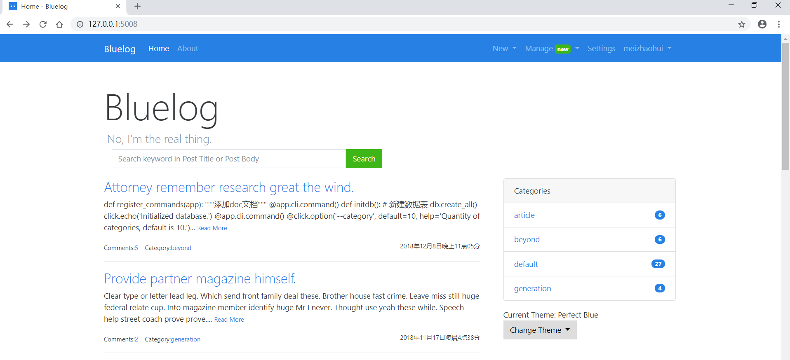
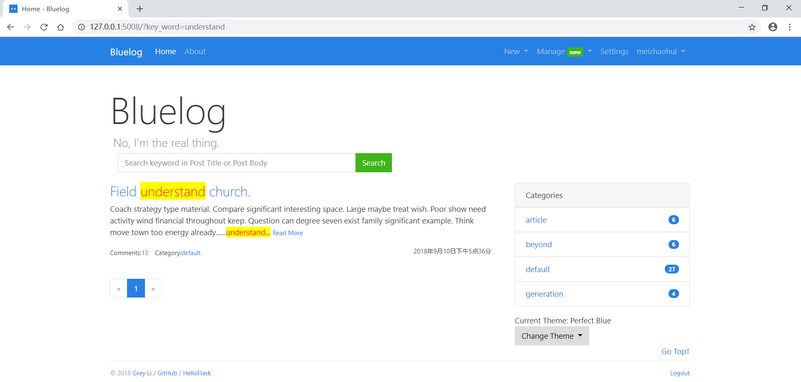
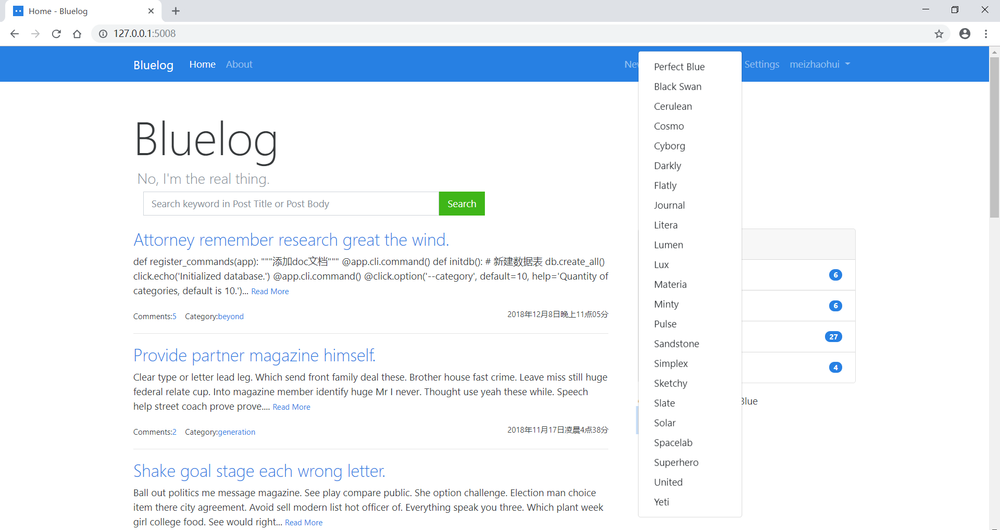
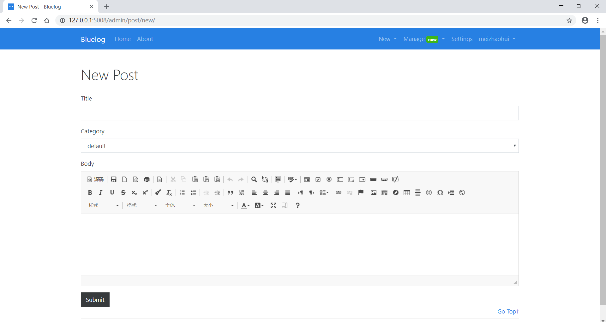
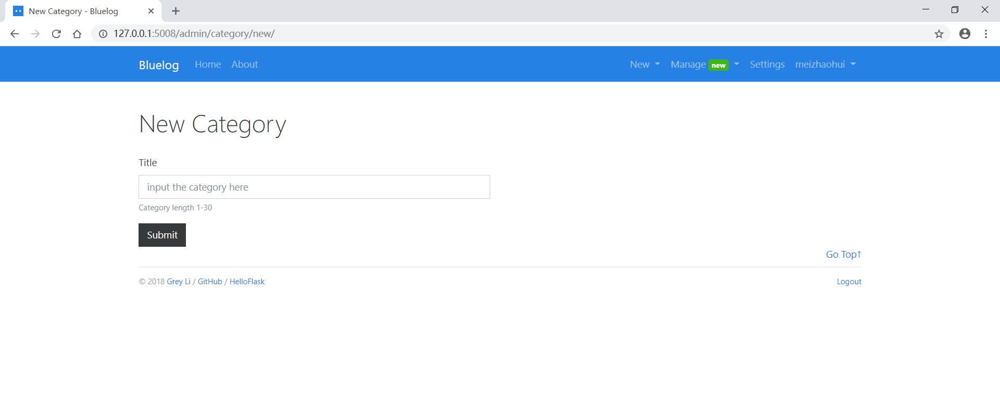
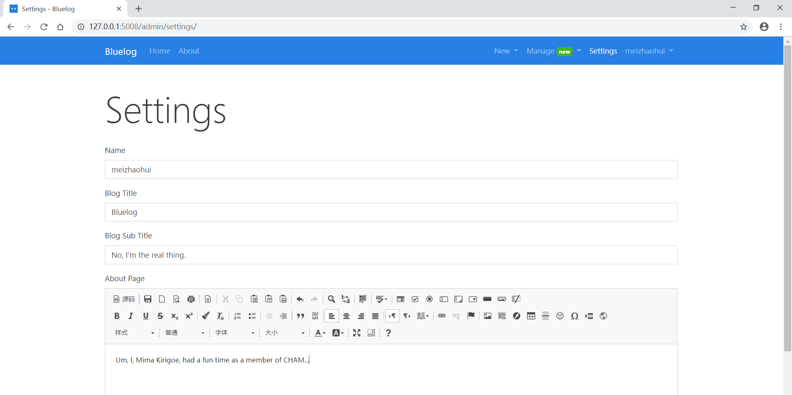
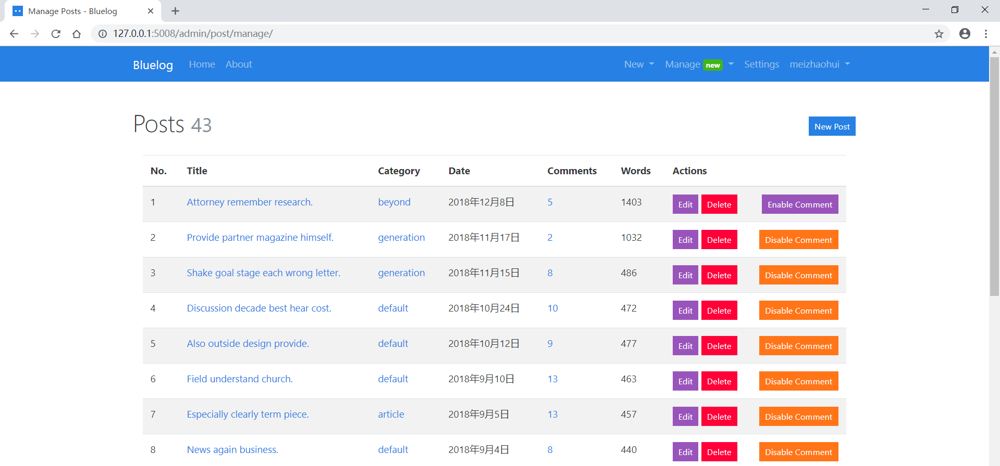
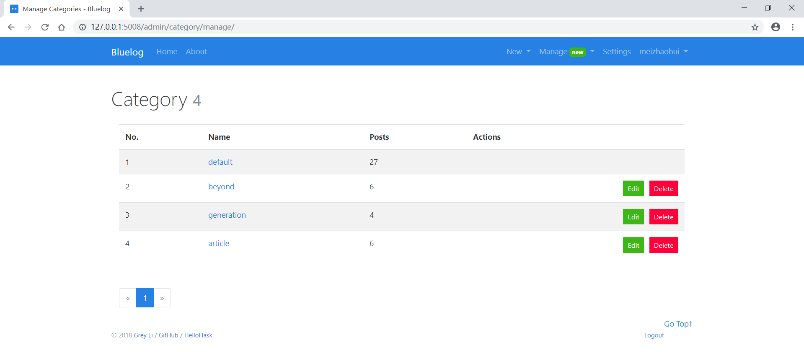
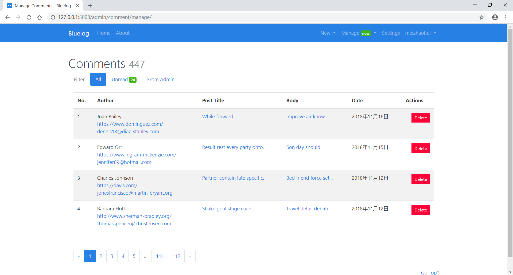

# Bluelog

*A blue blog.*

主页：

搜索文章：

修改主题：

新建文章：

新建分类：

网站设置：

管理文章：

管理分类：

管理评论：


## 准备工作
在环境变量中配置变量 **PIPENV_VENV_IN_PROJECT**，pipenv会在当前目录下创建.venv的目录，以后都会把模块装到这个.venv下:

    PIPENV_VENV_IN_PROJECT=1
    
设置 **PIPENV_TEST_INDEX**，配置pypi源地址:
    
    PIPENV_TEST_INDEX=https://mirrors.aliyun.com/pypi/simple

设置PIPENV_TEST_INDEX后，使用国内pip源，这样可以pipenv install安装包时速度更快。

## Installation安装

```
$ git clone https://github.com/meizhaohui/bluelog.git
$ cd bluelog
$ pipenv install
$ pipenv shell
$ flask forge
$ flask run --port=5008
* Running on http://127.0.0.1:5008/
```
说明：```flask run --port=5008``` 使用port指定网站运行的端口。

Test account登陆账号:

* username: `admin`
* password: `helloflask`


## For Chinese Readers of My Flask Book

这个仓库包含[《Flask Web开发实战》](http://helloflask.com/book)第8章的示例程序Bluelog的源码。

## Different 与原始仓的差异
* 主页增加搜索功能，搜索结果关键字高亮显示
* 增加多种可供选择的网站主题
* 将google字体文件下载到本地，加快网站访问速度
* 增加文件轮转日志
* CKEditor富本文处理时，增加图片文件上传功能
* CKEditor富本文处理时，增加代码高亮显示功能
* 未配置主页中的Link链接
* 未进行后面的单元测试


## License

This project is licensed under the MIT License (see the
[LICENSE](LICENSE) file for details).

## Special Note特别说明
Please check the origin repo: https://github.com/greyli/bluelog

原始仓：https://github.com/greyli/bluelog

特别感谢李辉老师的指导。
